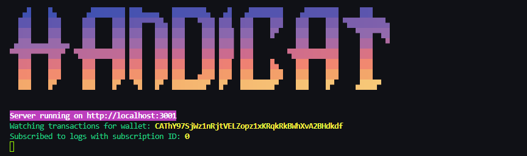

<!-- Improved compatibility of back to top link: See: https://github.com/othneildrew/Best-README-Template/pull/73 -->

<a id="readme-top"></a>

<!-- PROJECT LOGO -->
<br />
<div align="center">
  <a href="https://github.com/DracoR22/handi-cat_wallet-tracker">
    
  </a>

  <h3 align="center">🐱 Handi Cat | Wallet Tracker</h3>

  <p align="center">
    Track any Solana transaction in Real-Time
    <br />
    <br />
    <a href="https://t.me/handi_cat_bot"><strong>Use the Telegram bot -></strong></a>
  </p>
</div>

<!-- ABOUT THE PROJECT -->

## About The Project

[![Product Name Screen Shot][product-screenshot]](https://t.me/handi_cat_bot)

Handi Cat is a Telegram bot that can track any Solana wallet in real time, it provides relevant information
of each transaction made in Raydium, Jupiter, Pump.fun and Pump.fun AMM(Pump Swap) including transaction hash, tokens and amount swapped, price of the token in SOL, token market cap and much more.

## Features

- 📈 Tracks in Real-Time any SOL transfer
- 🔍 Detects Raydium, Jupiter, Pump.fun and Pump Swap transactions
- 💰 Gets SOL price of the token swapped
- 📊 Gets token market cap at the time swapped
- 💰 Gets token amount and supply percentage owned by each tracked wallet
- 🤖 Each transaction message includes links to popular Solana trading bots to quickly buy the token
- 🔗 Each transaction provides links to Photon, GMGN and Dex Screener to quickly see the token chart

<p align="right">(<a href="#readme-top">back to top</a>)</p>

## Bot Commands

- `/start` – Opens the bot's main menu
- `/add` – Add a new wallet address
- `/delete` – Delete a wallet addresss
- `/upgrade` – Access the subscription menu
- `/ban_wallet` – Flag a wallet as BANNED and remove it from the wallet pool **(admin only)**
- `/help_notify` – Learn how bot notifications work
- `/help_group` – Instructions for adding the bot to group chats

<p align="right">(<a href="#readme-top">back to top</a>)</p>

## Built With

- 🌐 Node.JS
- 📘 TypeScript
- 📊 Prisma ORM
- 🪙 Solana Web3.js

<p align="right">(<a href="#readme-top">back to top</a>)</p>

<!-- GETTING STARTED -->

## Getting Started

Follow these simple steps to setup Handi Cat locally on your machine

### Prerequisites

**Node version 14.x**

### Steps

1. Clone the repo

   ```sh
   git clone https://github.com/DracoR22/handi-cat_wallet-tracker.git
   ```

2. Install NPM packages

   ```sh
   pnpm install
   ```

3. Rename `.env.example` file to `.env`

4. Create a Postgres database and paste the connection string into `DATABASE_URL`

5. Create a new `Telegram Bot` using `Bot Father` and get your `BOT_TOKEN`, then paste it in the environment variable

6. Run migrate command to push the database schemas and generate all types

```sh
  pnpm db:migrate
```

7. Go to `src/providers/telegram.ts` and uncomment line 13, you will also need to comment everything after this line. We use this polling connection for local environments, if you decide to deploy the bot, then change it back to webhook connection

8. Now you have to setup an rpc provider in `src/providers/solana.ts`, you can change all NETWORKS to `SOLANA_NETWORK` if you dont have one

9. Start the bot

```sh
  pnpm start
```

10. That's it! now your local version of Handi Cat is ready, you can also fill the other environment variables to setup an RPC of your choice

<p align="center"></>

<p align="right">(<a href="#readme-top">back to top</a>)</p>

<!-- CONTACT -->

## Contact

<!-- [@your_twitter](https://twitter.com/your_username)  --> - rdraco039@gmail.com

My solana wallet for the struggles - `5EVQsbVErvJruJvi3v8i3sDSy58GUnGfewwRb8pJk8N1`

Project Link: [https://github.com/DracoR22/handi-cat_wallet-tracker](https://github.com/DracoR22/handi-cat_wallet-tracker)

<p align="right">(<a href="#readme-top">back to top</a>)</p>

<!-- MARKDOWN LINKS & IMAGES -->
<!-- https://www.markdownguide.org/basic-syntax/#reference-style-links -->

[contributors-shield]: https://img.shields.io/github/contributors/othneildrew/Best-README-Template.svg?style=for-the-badge
[contributors-url]: https://github.com/othneildrew/Best-README-Template/graphs/contributors
[forks-shield]: https://img.shields.io/github/forks/othneildrew/Best-README-Template.svg?style=for-the-badge
[forks-url]: https://github.com/othneildrew/Best-README-Template/network/members
[stars-shield]: https://img.shields.io/github/stars/othneildrew/Best-README-Template.svg?style=for-the-badge
[stars-url]: https://github.com/othneildrew/Best-README-Template/stargazers
[issues-shield]: https://img.shields.io/github/issues/othneildrew/Best-README-Template.svg?style=for-the-badge
[issues-url]: https://github.com/othneildrew/Best-README-Template/issues
[license-shield]: https://img.shields.io/github/license/othneildrew/Best-README-Template.svg?style=for-the-badge
[license-url]: https://github.com/othneildrew/Best-README-Template/blob/master/LICENSE.txt
[linkedin-shield]: https://img.shields.io/badge/-LinkedIn-black.svg?style=for-the-badge&logo=linkedin&colorB=555
[linkedin-url]: https://linkedin.com/in/othneildrew
[telegram-bot]: https://img.shields.io/badge/Telegram-2CA5E0?style=for-the-badge&logo=telegram&logoColor=white
[product-screenshot]: showcase/notifications-new.png
